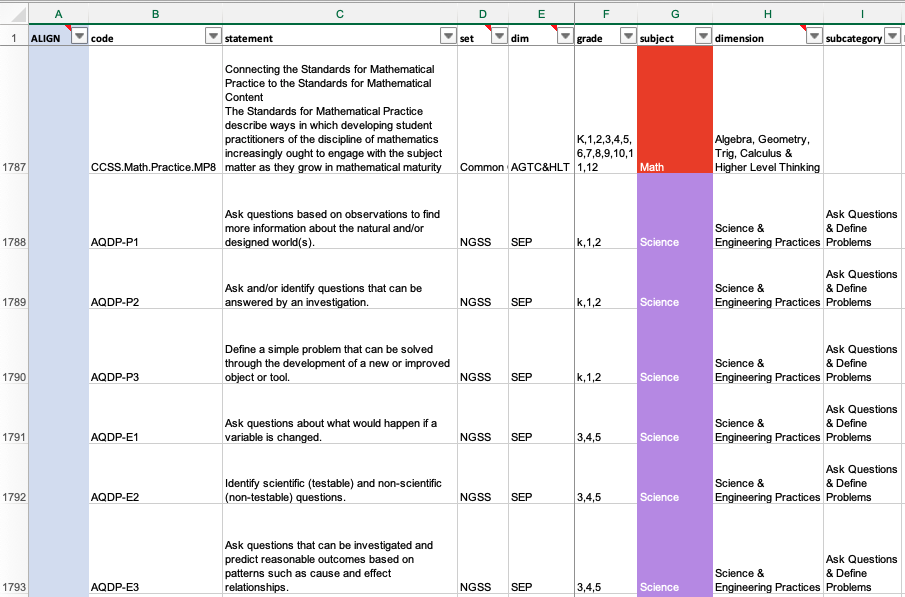

#### repository author/maintainer: [Matt Wilkins](http://www.mattwilkinsbio.com/)

<h2 id="title"> a project of
  , an education studio dedicated to translating current research into highly interdisciplinary lessons that are free for teachers. 
</h2>
<a href="https://www.galacticpolymath.com/lessons">Access lessons here.</a>

## What is this?
1. A single .xlsx file containing the major learning standards for the four main subjects in US K-12 public schools:
- [Next Generation Science Standards](https://www.nextgenscience.org/)
- [Common Core ELA (English Language Arts)](http://www.corestandards.org/ELA-Literacy/)
- [Common Core Math](http://www.corestandards.org/Math/)
- [College, Career, and Civic Life (C3) Social Studies Framework](https://www.socialstudies.org/standards/c3)

2. I've also included the UN Sustainable Development Goals. These are incredibly ambitious goals set by the international community to (among other things) eliminate poverty, hunger, gender inequality, fight climate change, and preserve 10% of terrestrial and marine habitat by 2030. These goals are aspirational, of course, but students need to see that there's hope and solutions to all the depressing problems we hear about on a daily basis. Here's a succinct, and inspiring explanation of why we should #teachSDGs by human rights advocate Malala Yousafzai:

<iframe src="https://player.vimeo.com/video/138852758" width="640" height="360" frameborder="0" allow="autoplay; fullscreen; picture-in-picture" allowfullscreen></iframe>

<a href="https://vimeo.com/138852758">Malala introducing the The Worlds Largest Lesson</a> from <a href="https://vimeo.com/worldslargestlesson">World&#039;s Largest Lesson</a> on <a href="https://vimeo.com">Vimeo</a>.

[Learn more at teachsdgs.org](http://www.teachsdgs.org/)

3. R scripts used to aggregate these data. Note the repo I got the SDGs from is no longer online.

## Motivations
As a [published researcher](https://scholar.google.com/citations?user=MZKGDvAAAAAJ&hl=en), I readily recognize that science without math makes no sense; science not communicated well does not move us forward; and science and society are influenced by each other in myriad ways. It's absolutely nuts that any of these subject should be taught in isolation—it hurts long-term retention because students don't see the value of isolated knowledge, and it doesn't prepare them for how problems will be encountered in the workplace. Yet, in 2021 lessons are still about as siloed as it was when I was a kid. 

Through my work with Vanderbilt University's Collaborative for STEM Education and Outreach, I had the unique opportunity to develop and teach interdisciplinary lessons in collaboration with teachers as a Resident Scientist at a middle school 5-days a week for 3 1/2 years. This was a fantastic experience, and I found that teachers and students were both very excited about the types of interdisciplinary lessons we were able to develop together. But part of the reason this was possible is that teachers were encouraged to work with me by their colleagues and the principal. It was understood that there would be a rich learning experience from bringing me into the classroom because I'm an expert who has a lot of creative ideas for blending together data, real-world problems, and human narratives. But for an unfamiliar English teacher to see the value in a lesson about [misinformation related to the correlation between hurricane intensity and climate change](https://docs.google.com/document/d/1uMYhNRgJbLd4Xnwx4yy5D71lioL6KyFTAWU5ZeA-cuA/edit#heading=h.fkzf9dxy3fcg), things needed to be aligned to English standards. But wouldn't this lesson fit just as easily in a science or social studies classroom? Couldn't it be designed in alignment to all subjects at once?

Turns out a central problem was that nobody seems to have even compiled these standards into 1 easily explorable data file. The standards are all explorable in their separate databases and it's kind of a hassle to go back and forth between them. Worse, if you're like me and want everything to be in a spreadsheet, where codes and statements are searchable, filterable, and sortable, you're outta luck. Common Core is available in a *really* complicated XML format. C3 was previously only in PDF form, and NGSS wasn't publicly downloadable anywhere I could find. There actually was an NSF and Gates Foundation-founded project to make *all the standards* (like all of em) around the world, in the US, etc. searchable. It's called the [Achievement Standards Network](http://www.achievementstandards.org/resources/ASNJurisdiction)—you've probably never heard of it; the downloadable formats are useless for the average person, the main search function is paywalled and seems pretty targeted at enterprise edtech companies. Partially funded by the American public...don't get me started :vomiting_face:

Anyway, long story short: the first step to making it easier for *anyone* to make interdisciplinary lessons that are actually useful to teachers is to have all the standards be searchable in 1 spreadsheet. So I made one! 

Please let me know if this file is useful to you! 
- tag me on Twitter: [@mattwilkinsbio](https://twitter.com/mattwilkinsbio)
- and follow GP: [@galacticPM](https://twitter.com/GalacticPM)

## Copyright and Licenses
Neither I (Matt Wilkins) nor Galactic Polymath claim any copyright to any of the standards aggregated here. I have merely compiled these multi-subject standards for the purpose of stimulating the development of interdisciplinary lessons and curricula.
- the Common Core State Standards are [© Copyright 2010. National Governors Association Center for Best Practices and Council of Chief State School Officers. All rights reserved.”](http://www.corestandards.org/public-license/)
- NGSS standards are offered through a public license: [NGSS Lead States. 2013. Next Generation Science Standards: For States, By States. Washington, DC: The National Academies Press.](https://www.nextgenscience.org/trademark-and-copyright##3.0), though see acknowledgements for reference to specific codes developed by Ted Willard.
- the C3 standards are published by [the National Council for the Social Studies, Silver Spring, MD under a public domain license.](https://www.socialstudies.org/sites/default/files/2017/Jun/c3-framework-for-social-studies-rev0617.pdf)

## Acknowledgements
- NGSS standards data were provided by Ted Willard. Codes for cross-cutting-concepts follow the system he developed for his book [*The NSTA Atlas of the Three Dimensions*](https://my.nsta.org/resource/117948).
- C3 standards were provided by [John Lee, PhD](https://ced.ncsu.edu/people/jklee/) through helpful communications with Dr. Kathy Swan

## Download and Explore
## Click the image below to download, explore and align lessons to the final collection of 2,534 standards for K-12:

<a href="https://raw.githubusercontent.com/galacticpolymath/standardX/master/align-to-all-subject-standards.xlsx" download> > align-to-all-subject-standards.xlsx</a>
